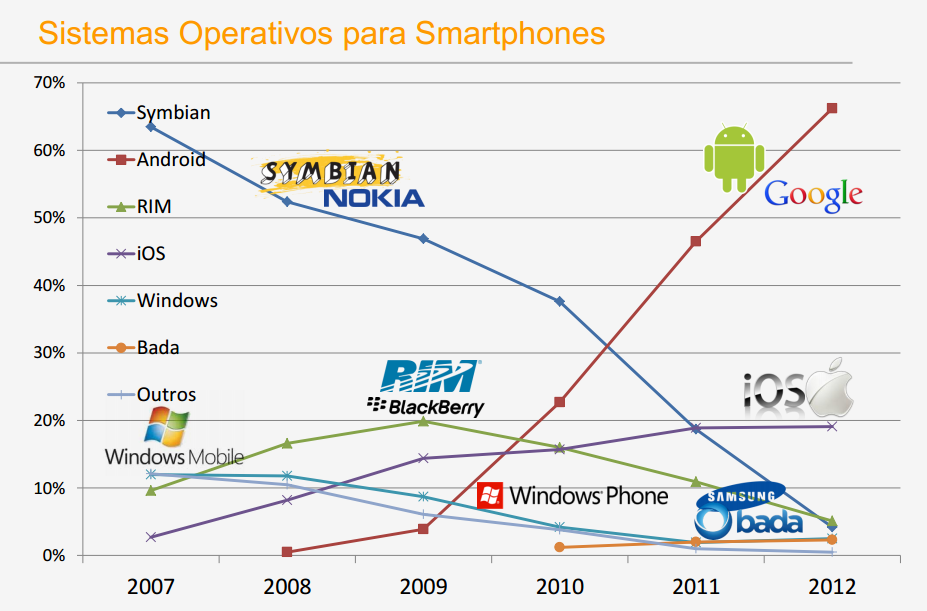

Análise da Tecnologia
=====================

Este documento contém o racional acerca das decisões tomadas pela equipa, no que concerne as tecnologias a utilizar.

Jukebox Android App
-------------------

O primeiro consenso obtido foi quanto à necessidade de haver uma aplicação para dispositivo móvel, compatível com a maioria dos dispositivos actuais.

Jukebox Display App
-------------------

Backoffice Web App
------------------

Webservice
----------

USB Device Detection
--------------------

BLL & DAL
---------

Database
--------

